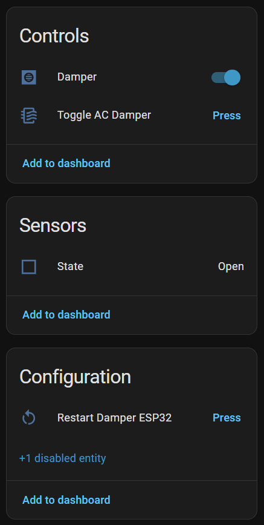

# ESPHome Electra Damper

## Why?
The AC units in my rooms have electric dampers that are controlled by an IR remote. I wanted to automate them using Home Assistant.

The easy approach is to use a smart IR controller (for example, Broadlink) and record the open/close commands. This solution has some disadvantages:

1. It's less fun.
2. It requires a spot with a direct line of sight to the IR receiver.
3. It requires a permanent power source.
4. It has no feedback - if something interrupts the line of sight, I won't know whether the command worked.

## Reversing the controller
I started by disassembling the controller and examining the circuit. This is what I found.

<table>
  <tr>
    <td align="center">
      
      
Controller case

    </td>
    <td align="center">
      
      
Controller front

    </td>
    <td align="center">
      
      
Controller back

    </td>
  </tr>
</table>

- It has four wires and two LEDs (green and red) that indicate state.
- It has a physical toggle button, which is great because I don't have to reverse-engineer the IR protocol - I can just emulate the button press.
- I tried feeding the pictures to some AI tools, but they were not helpful and provided incorrect answers.

I didn't have enough knowledge to inspect the circuit further, so I turned to the only diagnostic tool I'm familiar with: a multimeter. I reconnected the controller and started measuring voltages.

- I identified the yellow wire as VCC (12 V) and the green wire as GND.
- There were two other wires. I assumed one was a state/input line and the other was the control line.
- The black wire measured ≈12 V at idle and dropped to ≈2.5 V when I pressed the button to open the damper, each press changes the voltage again - this is the state line.
- The red wire measured ≈5 V at idle and briefly dropped to about 1–2 V when the button was pressed. I looked this up and determined it behaves like an active-low (pull-down) control line.
### Reversing summary

| Wire   | Function                                    |
|--------|---------------------------------------------|
| Yellow | VCC (12 V)                                  |
| Green  | GND                                         |
| Black  | State (≈2.5 V when open, ≈12 V when closed) |
| Red    | Control (active-low, ≈5 V idle)             |

## Building the smart damper
I decided to use an ESP32 board because it has a beginner-friendly workflow (ESPHome with ESPHome Builder) and an easy-to-use Home Assistant integration.
### VCC
The original controller uses a 12 V input, but ESP32 boards expect 5 V or 3.3 V. I used a DC buck converter to step the voltage down.

### State
The state voltage presented a challenge because ESP GPIO pins are limited to 3.3 V. I considered using an optocoupler to fully isolate the circuits, but I realized a 2.5 V "low" might still be enough to partially turn on an optocoupler LED, which would make detection unreliable.

Instead, I used a simple voltage divider with 10 kΩ and 3.3 kΩ resistors. This scales the ~2.5–12 V range down to roughly 0.6–3.0 V, which is safe for the ESP. This range is prefect for the default GPIO LOW\HIGH detection.

### Control
The simplest way to emulate the pull-down switch is with a transistor that connects the line to ground when activated. I used a 2N3904 NPN transistor: collector to the red wire, emitter to GND, and the base connected to a GPIO pin through a 1 kΩ resistor to protect the GPIO pin.

  <figure style="margin: 0; text-align: center;">
    
    <figcaption>ESP wiring (conceptual)</figcaption>
  </figure>

## ESPHome configuration
I implemented the transistor as an internal switch (no direct user control). A template button simulates the original controller's button press by turning the internal switch on for 200ms, allowing current to flow into the transistor base and actuating the pull-down. The button entity is exposed to Home Assistant to mimic the physical controller button.

A sensor reports the damper state; this is also reflected physically by the built-in RGB LED.

A template switch serves as the primary user interface for the damper. Its state is derived from the sensor so it reliably represents the actual damper position, and toggling the switch triggers the template button to change the damper state.

[Full ESPHome builder configuration yaml](damper.yaml)

  <figure style="margin: 0; text-align: center;">
    
    <figcaption>Home Assistant view</figcaption>
  </figure>

## TODO
* Replace the ESP32-S3 with a smaller ESP module (like the ESP-Super-Mini), use a compact buck converter, and fit everything into a small tidy case. This will require using an external LED indicator instead of the ESP32-S3's built-in LED.
* Turn the circuit diagram into a PCB and send it to manufecturing.
* For a network-failure-proof solution, keep a physical button like the original control or add an IR receiver to support the original remote.
* I might use the fact that I already have a powered ESP32 in a strategic spot and connect additional sensors (temperature, light, or presence).